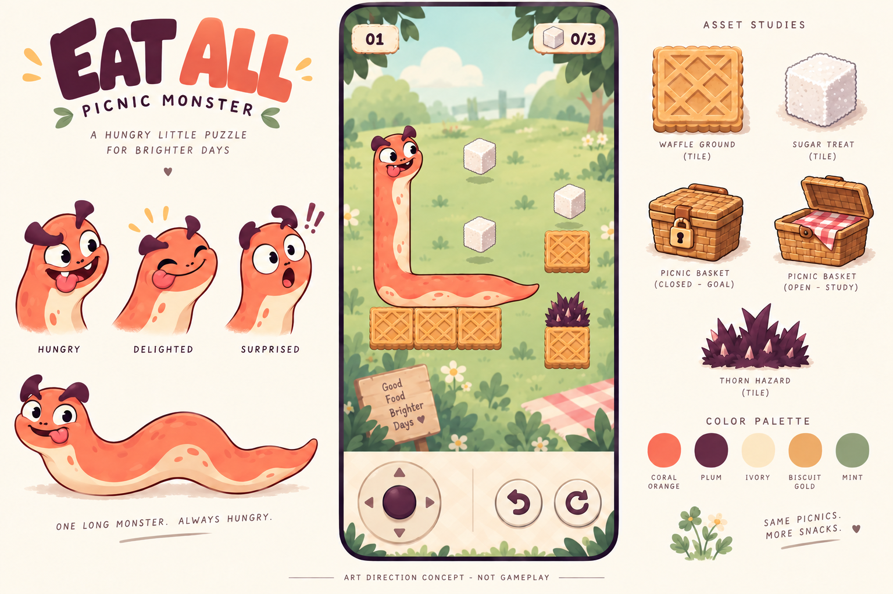

# 吃吃吃 · 竖屏休闲解谜框架提案

版本：v0.1，2026-09-29。状态：框架与美术方向供审，未开始游戏实现。

## 已确定与本轮建议

用户已确定：基于所提供视频的分析开展休闲游戏框架设计，美术偏欧美，优先竖屏，用虚拟轮盘操作方向。下面的角色造型、规则细节、关卡数量、引擎和首发系统是团队的成套建议，不是新增的用户决定。

**一句话：控制一只贪吃的软体小怪兽，用越吃越长的身体搭桥、转弯和保住支点，吃光点心，再回到野餐篮。**

设计支柱：操作少但每步有意义；失败原因能看懂且可撤销；表情与反馈轻松幽默，棋盘始终清晰。

## 玩家实际怎么玩

1. 进入一张竖屏小关卡，能同时看见食物、出口、身体与关键支点。
2. 左下轮盘拨向四个方向。短拨尝试走一格，长按按节奏连续走；不会斜走，也没有跳跃键。
3. 吃到一颗点心增长一格，长度能帮助跨越或向上够物，但也占用转弯空间。
4. 只要身体任何部分被地形从下方托住，就可以伸出其他部分；失去所有支点后，身体保持形状整体下落。
5. 吃完本关少量点心，出口由关闭变为就绪；角色头部在出口处落稳后过关。
6. 掉出地图或碰刺可以直接撤销上一步，不用重新付费、扣体力或重走整关。走进死胡同也能撤销。

完整规则的唯一来源为 [EA-R0.1](systems/core-framework.md)。食物不提供支撑；仅主动移动吃食物，下落不吃；重力后落稳判胜；无限撤销覆盖一个动作导致的全部下落。以上是EatAll的新规则提案，不宣称视频原作如此。

## 竖屏与轮盘

| 屏幕区域 | 内容与目的 |
|---|---|
| 顶部 | 当前关、食物进度、暂停；不放货币和商业化入口 |
| 中部 | 固定侧视棋盘，关内不滚屏，先保证关键支点可见 |
| 底部左侧 | 四向吸附虚拟轮盘；死区防抖，短拨一格，长按连续 |
| 底部右侧 | 撤销与重开，足够间距避免误触；可考虑左右手镜像 |

控制输入与棋盘区域分离，手指不挡路线。动画/下落期间不积压方向动作，松手后不补走；暂停/切后台清空持续输入。轮盘死区与节奏均为试调参数，见 [技术方案](technical/implementation-plan.md)，必须通过真机拇指操作验证。

## 关卡与长期内容结构

建议首版只做 **12关、1主题、1角色**，单关约30—90秒作为观察目标，未实测，不加倒计时。

- 1—2：第一口、增长搭桥。已有坐标样图和人工推演。
- 3—6：转弯、支点、尾部、计划下落。
- 7—10：碰刺、收集顺序、平台下路线、出口回程。
- 11—12：形状管理与前面规则的组合，不再加新机关。

[首章设计](levels/first-chapter.md)中后10关是设计简报，尚非成品地图。先制作代表性的3关灰盒验证输入和空间推理，再扩成12关；这两个阶段是获批后的制作顺序，不代表本轮已授权开工。

关外先保留开始/继续、选关、设置与本地解锁保存。首版不纳入体力、广告、内购、货币养成、排行榜、随机地图；跨会话恢复局中局面也不作为首版默认承诺。

## 欧美卡通方向

主推 **“烘焙野餐小怪兽”**：橘珊瑚色连续软体、奶油腹纹、深紫眉角，饥饿、得意、惊讶三类大表情；配华夫饼硬平台、方糖点心、野餐篮出口和紫色尖刺。采用圆润轮廓、清楚描边、柔和体积与克制背景细节，轻松而不低幼。

建议用二维网格规则配侧视2D插画和轻体积表现，无需为柔软外观引入复杂物理。美术的替代方向与资产规格见 [美术提案](art/visual-direction.md)。

此图用于角色、配色、材质和界面分区讨论。v2主画面遗漏出口，右侧单独展示了出口设计；棋盘未按最终关卡数据生成，不是可解性或功能完整性的证据。[生成提示词与审看边界](art/concepts/generation-notes.md)已保留，v1也作为修订前样张归档。

## 技术、验收与团队交接

建议首个可安装体验包采用 **Android + Godot/GDScript**，Unity/C#作为有明确团队/工具依赖时的备选。这里的Android与引擎尚未获用户确认；竖屏优先不等于用户已选择Android。需要iOS时先确认对应构建环境，不能把当前Windows环境当iOS交付验证。

逻辑采用确定性网格回合，动画只表现结果；同一初始状态和动作串得到同一结果。关卡数据、规则推进和撤销快照共用一套明确契约。详细技术取舍及官方依据在 [技术方案](technical/implementation-plan.md)。

| 角色 | 本轮成果 | 获批后首先验证 |
|---|---|---|
| 系统策划 | 核心循环、9类规则与顺序 | 增长/支撑/胜负的边界一致性 |
| 关卡策划 | 12关递进与2关人工推演 | 3个代表关在真实规则运行器重放 |
| 程序 | 轮盘、纯逻辑、数据、存档与技术路线 | 触屏回合闭环和撤销原子性 |
| 美术 | 主题、角色、视觉语义、概念板 | 默认屏幕下地形/身体/食物不混淆 |
| 测试 | 静态交叉复核与验收矩阵 | 输入误触、关卡重放、完整通关与保存 |

本轮[QA报告](../production/qa/framework-review.md)是文档静态复核，程序稿由同一成员兼任撰写，程序部分只算自查，不声称完全独立。未进行游戏运行、求解器、玩家体验或性能测试。

## 进入制作前的确认项

建议整体确认以下范围，再进入3关可玩原型：

1. 采用本提案的增长/整体重力规则、全点心后出口、无限撤销与12关目标。
2. 采用“烘焙野餐小怪兽”的欧美卡通方向；概念板认可只代表方向，不代表最终资产验收。
3. 首个体验包采用Android + Godot；若实际要iPhone先玩，改以iOS可用构建环境为前置安排。

竖屏和虚拟轮盘已经确定，不重复审批。原型通过后再展开剩余关卡与正式美术，不在体验尚未验证时承诺商业化扩展。
